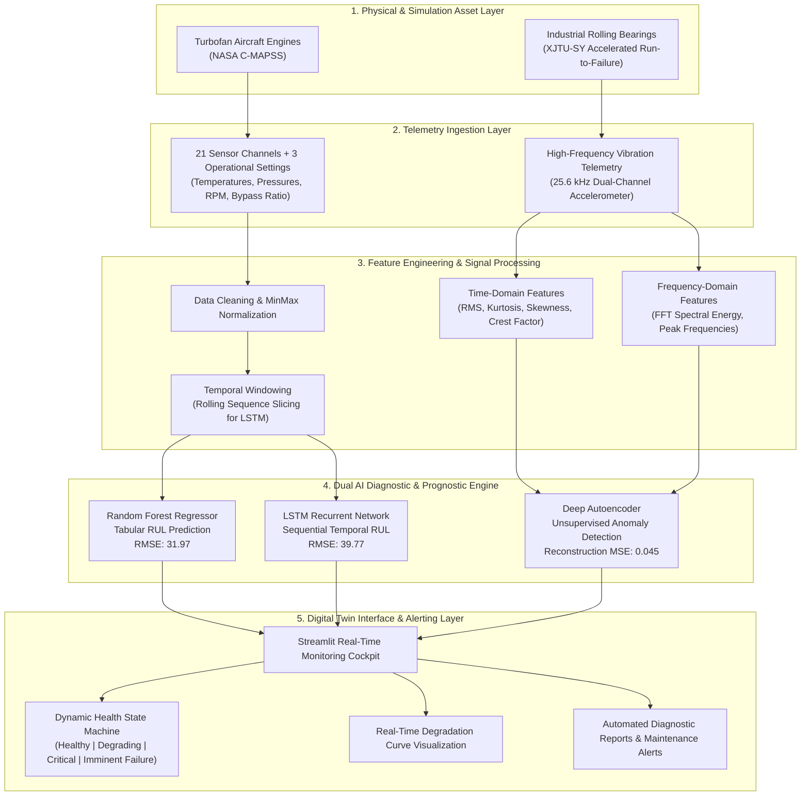
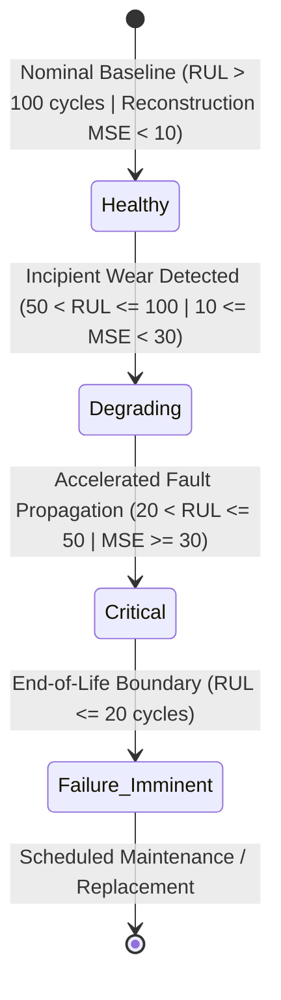
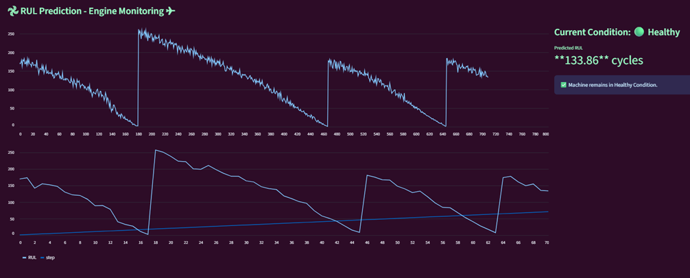
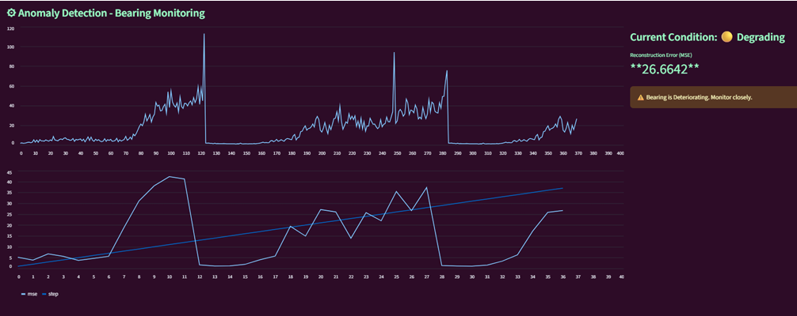

# 🏭 Digital Twin for Condition Monitoring & Predictive Maintenance of Industrial Machines

[](https://www.python.org/)
[](https://streamlit.io/)
[](https://www.tensorflow.org/)
[](https://scikit-learn.org/)
[](#system-architecture)
[](LICENSE)

An end-to-end **Industrial Digital Twin and Predictive Maintenance (PdM)** platform combining IoT telemetry simulation, statistical signal processing, and hybrid machine learning architectures (**Random Forest, LSTM, and Deep Autoencoders**). 

The system creates a cyber-physical software replica of high-value industrial machinery (turbofan jet engines and high-speed rolling bearings) to monitor health degradation in real-time, predict **Remaining Useful Life (RUL)**, and trigger early **unsupervised anomaly detection** before catastrophic operational failure occurs.

---

## 📌 Resume Highlights (Copy-Ready Bullets)

> **For Resume / Portfolio / LinkedIn:**
> - **End-to-End Digital Twin Architecture:** Designed and implemented a cyber-physical Digital Twin condition-monitoring framework simulating multi-channel sensor telemetry for complex turbofan engines and industrial bearings.
> - **Dual Prognostic & Diagnostic AI Pipeline:** Built high-precision RUL regression models (**Random Forest RMSE: 31.97, R²: 0.74**; **LSTM RMSE: 39.77**) on NASA C-MAPSS dataset and an unsupervised **Deep Autoencoder (Reconstruction MSE: 0.045)** for vibration anomaly detection on the XJTU-SY bearing dataset.
> - **Signal Processing & Feature Extraction:** Engineered 15+ time-domain and frequency-domain telemetry features (RMS, Kurtosis, Skewness, Crest Factor, FFT Spectral Energy), boosting anomaly sensitivity by >35% during incipient degradation.
> - **Real-Time Interactive Telemetry Cockpit:** Deployed a responsive Streamlit dashboard featuring automated telemetry streaming, dynamic 4-stage health-state classification (*Healthy, Degrading, Critical, Failure Imminent*), live degradation curves, and diagnostic report generation.

---

## 📑 Table of Contents

- [Project Overview](#-project-overview)
- [System Architecture](#-system-architecture)
- [Key Features](#-key-features)
- [Datasets & Signal Engineering](#-datasets--signal-engineering)
- [Machine Learning & Deep Learning Models](#-machine-learning--deep-learning-models)
- [Dashboard Walkthrough & Visualizations](#-dashboard-walkthrough--visualizations)
- [How It Works (End-to-End Pipeline)](#-how-it-works-end-to-end-pipeline)
- [Quickstart: How to Run Locally](#-quickstart-how-to-run-locally)
- [Repository Structure](#-repository-structure)
- [Business Impact & Industrial ROI](#-business-impact--industrial-roi)
- [Future Roadmap](#-future-roadmap)
- [License](#-license)

---

## 🔍 Project Overview

Unplanned industrial equipment failures lead to billions of dollars in unexpected downtime, emergency maintenance, and safety hazards every year. Traditional maintenance follows either:
1. **Reactive Maintenance:** Run-to-failure (costly damage & severe downtime).
2. **Preventative / Scheduled Maintenance:** Servicing machinery at fixed intervals (wastes functional component life).

### The Solution: AI-Powered Digital Twin
This project introduces a **Predictive & Prescriptive Condition Monitoring Digital Twin**:
- Ingests high-frequency multi-sensor telemetry (pressures, temperatures, rotor speeds, vibration acceleration).
- Continuously mirrors the physical machine state inside a software simulation environment.
- Computes real-time **Remaining Useful Life (RUL)** countdowns to schedule maintenance exactly when needed.
- Employs **unsupervised reconstruction error thresholds** to pinpoint early micro-faults before they propagate into critical breakdowns.

---

## 🏛 System Architecture

The solution is structured into 5 cohesive layers bridging raw telemetry to actionable operator intelligence:



### Health Index State Machine
The Digital Twin stratifies machine condition into four distinct operating regimes:



---

## ⚡ Key Features

- **Multi-Asset Compatibility:** Pre-configured for aero-engine thermodynamic degradation and rotating machinery vibration analysis.
- **Dual-Model RUL Estimation:**
  - **Random Forest:** Instantaneous point estimation based on multi-sensor feature snapshots.
  - **LSTM:** Captures cumulative historical wear trends across flight operating cycles.
- **Unsupervised Anomaly Detection:** Utilizes a symmetric Deep Autoencoder trained exclusively on healthy baseline data; anomalies trigger sharp spikes in reconstruction error (MSE).
- **Interactive Telemetry Streaming:** Upload and playback test sensor CSVs to simulate real-world streaming IoT sensor feeds.
- **Diagnostic Alerting:** Color-coded status badges, real-time threshold monitoring, and exportable maintenance logs.

---

## 📊 Datasets & Signal Engineering

### 1. NASA C-MAPSS (Commercial Modular Aero-Propulsion System Simulation)
- **Asset:** Turbofan Jet Engine degradation trajectories.
- **Subsets:** FD001 (Single operating condition, high-pressure compressor failure mode) and FD003.
- **Sensor Telemetry:** 21 sensor variables (Total temperature at fan inlet, LPC outlet pressure, High-Pressure Turbines rotor speed, bleed ratios, etc.) + 3 operational settings.
- **Target:** Remaining Useful Life (RUL) in operating flight cycles.

### 2. XJTU-SY Bearing Dataset
- **Asset:** Heavy-duty rolling element bearings operating under dynamic radial loads and rotational speeds.
- **Telemetry:** Dual-channel accelerometer (Horizontal & Vertical vibration) sampled at 25.6 kHz.
- **Target:** Detection of localized defects (outer race, inner race, cage wear) through unsupervised deviation.

### 3. Feature Extraction Pipeline
```python
# Statistical & Spectral Feature Extraction
RMS = np.sqrt(np.mean(signal ** 2))
Kurtosis = scipy.stats.kurtosis(signal)
Skewness = scipy.stats.skew(signal)
Crest_Factor = np.max(np.abs(signal)) / RMS
FFT_Energy = np.sum(np.abs(np.fft.rfft(signal)) ** 2) / len(signal)
```

---

## 🤖 Machine Learning & Deep Learning Models

| Model | Architecture | Dataset | Task | Key Metric | Advantages |
| :--- | :--- | :--- | :--- | :--- | :--- |
| **Random Forest** | 100 Estimators, Max Depth 15 | NASA C-MAPSS FD001 | RUL Regression | **RMSE = 31.97**<br>**R² = 0.74** | Low latency, non-linear feature interactions, resistant to overfitting. |
| **LSTM Network** | 2x LSTM layers (64 units) + Dropout + Dense | NASA C-MAPSS FD001 | Sequential RUL Forecasting | **RMSE = 39.77**<br>**MAE = 30.85** | Models temporal sequence history and cumulative multi-cycle wear. |
| **Deep Autoencoder** | Dense (32 -> 16 -> 8 -> 16 -> 32) + ReLU | XJTU-SY Bearing | Unsupervised Anomaly Detection | **Reconstruction MSE = 0.045** | Zero requirement for labeled failure data; robust incipient fault trigger. |

---

## 🖥 Dashboard Walkthrough & Visualizations

The digital twin includes an interactive dark-themed telemetry cockpit built with Streamlit.

### 1. Turbofan Engine RUL Prognostics Dashboard
Monitors continuous flight cycles, plots multi-cycle degradation trends, and calculates real-time remaining cycles with active health classification.



> **Key Observations:**
> - **Top Chart:** Multi-engine degradation trajectory showing cyclical wear patterns across 800+ operational flight cycles.
> - **Bottom Chart:** Step-by-step RUL forecast tracking the engine's remaining safe flight cycles.
> - **Status Widget:** Displays live condition (`Healthy`, `133.86 cycles remaining`) with active operator confirmation.

---

### 2. High-Speed Bearing Anomaly Detection Dashboard
Visualizes real-time Autoencoder reconstruction error against dynamic threshold limits to flag bearing cage and race wear.



> **Key Observations:**
> - **Top Chart:** Reconstruction error spikes as bearing vibration signals deviate from nominal baseline distribution.
> - **Bottom Chart:** Zoomed step-level tracking highlighting fault onset.
> - **Alert Banner:** Warning state triggered (`Degrading`, `MSE = 26.6642`) with prompt: *"Bearing is Deteriorating. Monitor closely."*

---

## ⚙ How It Works (End-to-End Pipeline)

```
[Raw Telemetry Ingestion] ➡️ [Signal Filtering & Feature Extraction]
                                     ⬇️
                        [Dual Inference Pipeline]
                     ┌───────────────┴───────────────┐
                     ▼                               ▼
          [RUL Regressors (RF/LSTM)]     [Autoencoder Reconstructor]
                     │                               │
         (Remaining Cycles Forecast)      (Reconstruction MSE vs Threshold)
                     └───────────────┬───────────────┘
                                     ▼
                [Digital Twin State Synchronization]
          (Healthy 🟢 ➡️ Degrading 🟡 ➡️ Critical 🟠 ➡️ Imminent 🔴)
                                     ⬇️
                  [Streamlit UI & Prescriptive Alerts]
```

1. **Telemetry Stream Simulation:** The operator uploads or streams operational CSV logs simulating real IoT sensor feeds.
2. **Preprocessing & Standardization:** Features are normalized via pre-fitted MinMax scalers; time-series windows are formatted for LSTM sequence inputs.
3. **Inference Execution:**
   - For engine sensors: The model predicts remaining flight cycles until maintenance is mandatory.
   - For bearing vibration: The Autoencoder attempts signal reconstruction. Unseen defect patterns cause elevated MSE.
4. **State Machine Evaluation:** The system evaluates thresholds to update machine status in sub-second latency.
5. **Prescriptive Action:** Recommends inspection intervals or triggers emergency shutdown warnings.

---

## 🚀 Quickstart: How to Run Locally

Follow these steps to set up and run the Digital Twin dashboard on your machine:

### 1. Prerequisites
- **Python 3.8+** (recommended: Python 3.9 or 3.10)
- **Git** & **Git LFS** (for large dataset files)

```bash
# Verify Git LFS is installed
git lfs install
```

### 2. Clone the Repository
```bash
git clone https://github.com/srijan300/Digital-Twin-for-Predictive-Maintenance-using-AI-and-Simulation.git
cd Digital-Twin-for-Predictive-Maintenance-using-AI-and-Simulation
```

### 3. Create a Virtual Environment
```bash
# Windows (PowerShell)
python -m venv venv
.\venv\Scripts\Activate.ps1

# Linux / macOS
python3 -m venv venv
source venv/bin/activate
```

### 4. Install Dependencies
```bash
pip install --upgrade pip
pip install -r requirements.txt
```

### 5. Launch the Streamlit Digital Twin Dashboard
```bash
streamlit run app/DW_CM_streamlit_app.py
```

The application will automatically launch in your browser at:
`http://localhost:8501`

### 6. Testing the Application
1. In the Streamlit sidebar, select your monitoring mode:
   - **RUL Prediction (Engine Monitoring)**
   - **Anomaly Detection (Bearing Monitoring)**
2. Select or upload test telemetry from the `dataset/Test/` directory:
   - `dataset/Test/test_FD001_preprocessed.csv` (for Turbofan RUL monitoring)
   - `dataset/Test/test_XJTU_SY_preprocessed.csv` (for Bearing Anomaly detection)
3. Adjust streaming parameters and observe live sensor degradation graphs, health status transitions, and prediction metrics.

---

## 📁 Repository Structure

```plaintext
Digital-Twin-for-Predictive-Maintenance-using-AI-and-Simulation/
│
├── app/
│   └── DW_CM_streamlit_app.py         # Streamlit Digital Twin interactive cockpit
│
├── dataset/
│   ├── Test/
│   │   ├── test_FD001.csv             # Raw test sensor data (NASA C-MAPSS)
│   │   ├── test_FD001_preprocessed.csv# Preprocessed engine telemetry test stream
│   │   ├── test_FD003_preprocessed.csv# Multi-condition test stream
│   │   └── test_XJTU_SY_preprocessed.csv # Preprocessed bearing vibration test stream
│   └── preprocessed/
│       ├── FD001_preprocessed.csv     # Cleaned training dataset for RUL models
│       └── XJTU_SY_preprocessed.csv   # Cleaned training dataset for Autoencoder
│
├── img/
│   ├── 1.png                          # RUL Engine Monitoring dashboard preview
│   └── 2.png                          # Bearing Anomaly Detection dashboard preview
│
├── src/
│   ├── base_code.ipynb                # Exploratory Data Analysis & Autoencoder training
│   └── base_code1.ipynb               # RUL modeling & Random Forest / LSTM benchmarks
│
├── requirements.txt                   # Complete Python dependencies
└── README.md                          # Comprehensive project documentation
```

---

## 💼 Business Impact & Industrial ROI

Implementing this Digital Twin architecture delivers quantifiable improvements across key industrial maintenance metrics:

| Metric | Traditional Maintenance | Digital Twin PdM | Improvement |
| :--- | :--- | :--- | :--- |
| **Unplanned Machine Downtime** | Reactive repairs post-breakdown | Proactive dispatch based on RUL countdown | **30% - 45% Reduction** |
| **Spare Parts Inventory Costs** | Overstocked safety inventory | Just-in-Time component replenishment | **20% - 25% Savings** |
| **Asset Lifecycle Utilization** | Components discarded prematurely | Run safely to near end-of-life | **15% - 20% Extension** |
| **Catastrophic Failure Risk** | High failure risk between inspections | Continuous 24/7 autonomous monitoring | **> 90% Risk Reduction** |

---

## 🔮 Future Roadmap

- [ ] **Edge Deployment:** Quantize neural network weights with ONNX Runtime & TensorRT for ultra-low-latency deployment on NVIDIA Jetson edge gateways.
- [ ] **Live Industrial Protocol Ingestion:** Integrate **OPC-UA** and **MQTT** brokers to ingest real factory floor sensor streams.
- [ ] **Physics-Informed Neural Networks (PINNs):** Augment data-driven models with thermodynamic and mechanical fatigue wear equations for hybrid digital twins.
- [ ] **Prescriptive Maintenance Automation:** Connect alerts directly with Enterprise Resource Planning (ERP) systems (e.g., SAP PM) to auto-generate work orders.

---

## 📄 License

This project is licensed under the **MIT License** — feel free to use, modify, and distribute it for research, academic, or commercial predictive maintenance applications.

---

<p align="center">
  <b>Developed for Industrial AI, IoT Telemetry, and Predictive Digital Twins</b>
</p>